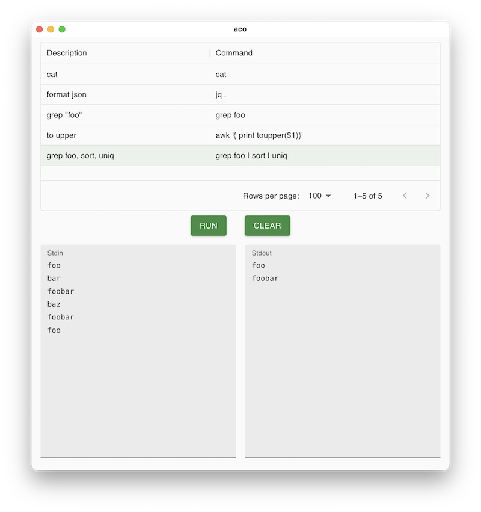

# aco

Apply shell COmmand



## Setup

Command settings are loaded from `~/.config/aco/aco.yaml`.

```yaml
commands:
  - cmd: jq .
    description: format json
  - pipeline:
      - grep foo
      - sort
      - uniq
    description: grep foo, sort, uniq
```

## License

MIT
